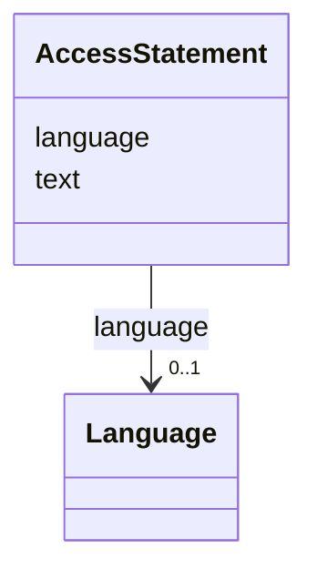

# Class: AccessStatement


URI: [https://raid.org/datamodel/api/raid/core/:AccessStatement](https://raid.org/datamodel/api/raid/core/:AccessStatement)





<!-- no inheritance hierarchy -->


## Slots

| Name | Cardinality and Range | Description | Inheritance |
| ---  | --- | --- | --- |
| [text](text.md) | 0..1 <br/> [String](String.md) |  | direct |
| [language](language.md) | 0..1 <br/> [Language](Language.md) |  | direct |


## Usages

| used by | used in | type | used |
| ---  | --- | --- | --- |
| [Access](Access.md) | [statement](statement.md) | range | [AccessStatement](AccessStatement.md) |


## Identifier and Mapping Information


### Schema Source


* from schema: https://raid.org/datamodel/api/raid/core


## Mappings

| Mapping Type | Mapped Value |
| ---  | ---  |
| self | https://raid.org/datamodel/api/raid/core/:AccessStatement |
| native | https://raid.org/datamodel/api/raid/core/:AccessStatement |


## LinkML Source

<!-- TODO: investigate https://stackoverflow.com/questions/37606292/how-to-create-tabbed-code-blocks-in-mkdocs-or-sphinx -->

### Direct

<details>
```yaml
name: AccessStatement
from_schema: https://raid.org/datamodel/api/raid/core
slots:
- text
- language

```
</details>

### Induced

<details>
```yaml
name: AccessStatement
from_schema: https://raid.org/datamodel/api/raid/core
attributes:
  text:
    name: text
    from_schema: https://raid.org/datamodel/api/raid/core
    rank: 1000
    alias: text
    owner: AccessStatement
    domain_of:
    - Title
    - Description
    - AccessStatement
    - SubjectKeyword
    - SpatialCoveragePlace
    range: string
  language:
    name: language
    from_schema: https://raid.org/datamodel/api/raid/core
    rank: 1000
    alias: language
    owner: AccessStatement
    domain_of:
    - Title
    - Description
    - AccessStatement
    - SubjectKeyword
    - SpatialCoveragePlace
    range: Language

```
</details>