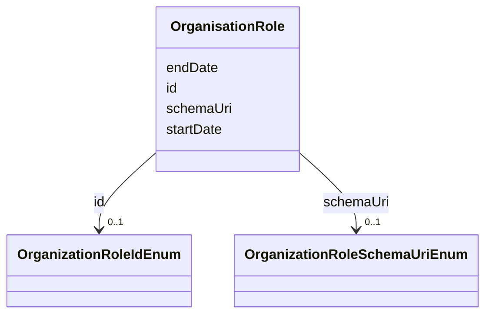

# Class: OrganisationRole


URI: [https://raid.org/datamodel/api/raid/core/:OrganisationRole](https://raid.org/datamodel/api/raid/core/:OrganisationRole)





<!-- no inheritance hierarchy -->


## Slots

| Name | Cardinality and Range | Description | Inheritance |
| ---  | --- | --- | --- |
| [startDate](startDate.md) | 1 <br/> [String](String.md) |  | direct |
| [endDate](endDate.md) | 0..1 <br/> [String](String.md) |  | direct |
| [schemaUri](schemaUri.md) | 0..1 <br/> [OrganizationRoleSchemaUriEnum](OrganizationRoleSchemaUriEnum.md) |  | direct |
| [id](id.md) | 0..1 <br/> [OrganizationRoleIdEnum](OrganizationRoleIdEnum.md) |  | direct |


## Usages

| used by | used in | type | used |
| ---  | --- | --- | --- |
| [Organisation](Organisation.md) | [role](role.md) | range | [OrganisationRole](OrganisationRole.md) |


## Identifier and Mapping Information


### Schema Source


* from schema: https://raid.org/datamodel/api/raid/core


## Mappings

| Mapping Type | Mapped Value |
| ---  | ---  |
| self | https://raid.org/datamodel/api/raid/core/:OrganisationRole |
| native | https://raid.org/datamodel/api/raid/core/:OrganisationRole |


## LinkML Source

<!-- TODO: investigate https://stackoverflow.com/questions/37606292/how-to-create-tabbed-code-blocks-in-mkdocs-or-sphinx -->

### Direct

<details>
```yaml
name: OrganisationRole
from_schema: https://raid.org/datamodel/api/raid/core
slots:
- startDate
- endDate
attributes:
  schemaUri:
    name: schemaUri
    from_schema: https://raid.org/datamodel/api/raid/core
    domain_of:
    - Id
    - Contributor
    - Organisation
    - RelatedObject
    - Owner
    - RegistrationAgency
    - TitleType
    - DescriptionType
    - AccessType
    - ContributorPosition
    - ContributorRole
    - OrganisationRole
    - RelatedRaidType
    - RelatedObjectType
    - RelatedObjectCategory
    - Language
    - Subject
    - SpatialCoverage
    - TraditionalKnowledgeLabel
    range: OrganizationRoleSchemaUriEnum
  id:
    name: id
    from_schema: https://raid.org/datamodel/api/raid/core
    domain_of:
    - ClosedRaid
    - Id
    - Contributor
    - Organisation
    - RelatedRaid
    - RelatedObject
    - AlternateIdentifier
    - Owner
    - RegistrationAgency
    - TitleType
    - DescriptionType
    - AccessType
    - ContributorPosition
    - ContributorRole
    - OrganisationRole
    - RelatedRaidType
    - RelatedObjectType
    - RelatedObjectCategory
    - Language
    - Subject
    - SpatialCoverage
    - TraditionalKnowledgeLabel
    range: OrganizationRoleIdEnum

```
</details>

### Induced

<details>
```yaml
name: OrganisationRole
from_schema: https://raid.org/datamodel/api/raid/core
attributes:
  schemaUri:
    name: schemaUri
    from_schema: https://raid.org/datamodel/api/raid/core
    alias: schemaUri
    owner: OrganisationRole
    domain_of:
    - Id
    - Contributor
    - Organisation
    - RelatedObject
    - Owner
    - RegistrationAgency
    - TitleType
    - DescriptionType
    - AccessType
    - ContributorPosition
    - ContributorRole
    - OrganisationRole
    - RelatedRaidType
    - RelatedObjectType
    - RelatedObjectCategory
    - Language
    - Subject
    - SpatialCoverage
    - TraditionalKnowledgeLabel
    range: OrganizationRoleSchemaUriEnum
  id:
    name: id
    from_schema: https://raid.org/datamodel/api/raid/core
    alias: id
    owner: OrganisationRole
    domain_of:
    - ClosedRaid
    - Id
    - Contributor
    - Organisation
    - RelatedRaid
    - RelatedObject
    - AlternateIdentifier
    - Owner
    - RegistrationAgency
    - TitleType
    - DescriptionType
    - AccessType
    - ContributorPosition
    - ContributorRole
    - OrganisationRole
    - RelatedRaidType
    - RelatedObjectType
    - RelatedObjectCategory
    - Language
    - Subject
    - SpatialCoverage
    - TraditionalKnowledgeLabel
    range: OrganizationRoleIdEnum
  startDate:
    name: startDate
    from_schema: https://raid.org/datamodel/api/raid/core
    rank: 1000
    alias: startDate
    owner: OrganisationRole
    domain_of:
    - Date
    - Title
    - ContributorPosition
    - OrganisationRole
    range: string
    required: true
  endDate:
    name: endDate
    from_schema: https://raid.org/datamodel/api/raid/core
    rank: 1000
    alias: endDate
    owner: OrganisationRole
    domain_of:
    - Date
    - Title
    - ContributorPosition
    - OrganisationRole
    range: string

```
</details>