# Class: RaidDto


URI: [https://raid.org/datamodel/api/raid/core/:RaidDto](https://raid.org/datamodel/api/raid/core/:RaidDto)

```mermaid
 classDiagram
    class RaidDto
    click RaidDto href "../RaidDto"
      RaidDto <|-- RaidCreateRequest
        click RaidCreateRequest href "../RaidCreateRequest"
      RaidDto <|-- RaidUpdateRequest
        click RaidUpdateRequest href "../RaidUpdateRequest"
      
      RaidDto : access
        
          
    
    
    RaidDto --> "0..1" Access : access
    click Access href "../Access"

        
      RaidDto : alternateIdentifier
        
          
    
    
    RaidDto --> "*" AlternateIdentifier : alternateIdentifier
    click AlternateIdentifier href "../AlternateIdentifier"

        
      RaidDto : alternateUrl
        
          
    
    
    RaidDto --> "*" AlternateUrl : alternateUrl
    click AlternateUrl href "../AlternateUrl"

        
      RaidDto : contributor
        
          
    
    
    RaidDto --> "*" Contributor : contributor
    click Contributor href "../Contributor"

        
      RaidDto : date
        
          
    
    
    RaidDto --> "0..1" Date : date
    click Date href "../Date"

        
      RaidDto : description
        
          
    
    
    RaidDto --> "*" Description : description
    click Description href "../Description"

        
      RaidDto : identifier
        
          
    
    
    RaidDto --> "0..1" Id : identifier
    click Id href "../Id"

        
      RaidDto : metadata
        
          
    
    
    RaidDto --> "0..1" Metadata : metadata
    click Metadata href "../Metadata"

        
      RaidDto : organisation
        
          
    
    
    RaidDto --> "*" Organisation : organisation
    click Organisation href "../Organisation"

        
      RaidDto : relatedObject
        
          
    
    
    RaidDto --> "*" RelatedObject : relatedObject
    click RelatedObject href "../RelatedObject"

        
      RaidDto : relatedRaid
        
          
    
    
    RaidDto --> "*" RelatedRaid : relatedRaid
    click RelatedRaid href "../RelatedRaid"

        
      RaidDto : spatialCoverage
        
          
    
    
    RaidDto --> "*" SpatialCoverage : spatialCoverage
    click SpatialCoverage href "../SpatialCoverage"

        
      RaidDto : subject
        
          
    
    
    RaidDto --> "*" Subject : subject
    click Subject href "../Subject"

        
      RaidDto : title
        
          
    
    
    RaidDto --> "*" Title : title
    click Title href "../Title"

        
      RaidDto : traditionalKnowledgeLabel
        
          
    
    
    RaidDto --> "*" TraditionalKnowledgeLabel : traditionalKnowledgeLabel
    click TraditionalKnowledgeLabel href "../TraditionalKnowledgeLabel"

        
      
```





## Inheritance
* **RaidDto**
    * [RaidCreateRequest](RaidCreateRequest.md)
    * [RaidUpdateRequest](RaidUpdateRequest.md)


## Slots

| Name | Cardinality and Range | Description | Inheritance |
| ---  | --- | --- | --- |
| [metadata](metadata.md) | 0..1 <br/> [Metadata](Metadata.md) |  | direct |
| [title](title.md) | * <br/> [Title](Title.md) |  | direct |
| [date](date.md) | 0..1 <br/> [Date](Date.md) |  | direct |
| [description](description.md) | * <br/> [Description](Description.md) |  | direct |
| [access](access.md) | 0..1 <br/> [Access](Access.md) |  | direct |
| [alternateUrl](alternateUrl.md) | * <br/> [AlternateUrl](AlternateUrl.md) |  | direct |
| [contributor](contributor.md) | * <br/> [Contributor](Contributor.md) |  | direct |
| [organisation](organisation.md) | * <br/> [Organisation](Organisation.md) |  | direct |
| [relatedRaid](relatedRaid.md) | * <br/> [RelatedRaid](RelatedRaid.md) |  | direct |
| [relatedObject](relatedObject.md) | * <br/> [RelatedObject](RelatedObject.md) |  | direct |
| [alternateIdentifier](alternateIdentifier.md) | * <br/> [AlternateIdentifier](AlternateIdentifier.md) |  | direct |
| [subject](subject.md) | * <br/> [Subject](Subject.md) |  | direct |
| [spatialCoverage](spatialCoverage.md) | * <br/> [SpatialCoverage](SpatialCoverage.md) |  | direct |
| [traditionalKnowledgeLabel](traditionalKnowledgeLabel.md) | * <br/> [TraditionalKnowledgeLabel](TraditionalKnowledgeLabel.md) |  | direct |
| [identifier](identifier.md) | 0..1 <br/> [Id](Id.md) |  | direct |


## Identifier and Mapping Information


### Schema Source


* from schema: https://raid.org/datamodel/api/raid/core


## Mappings

| Mapping Type | Mapped Value |
| ---  | ---  |
| self | https://raid.org/datamodel/api/raid/core/:RaidDto |
| native | https://raid.org/datamodel/api/raid/core/:RaidDto |


## LinkML Source

<!-- TODO: investigate https://stackoverflow.com/questions/37606292/how-to-create-tabbed-code-blocks-in-mkdocs-or-sphinx -->

### Direct

<details>
```yaml
name: RaidDto
from_schema: https://raid.org/datamodel/api/raid/core
slots:
- metadata
- title
- date
- description
- access
- alternateUrl
- contributor
- organisation
- relatedRaid
- relatedObject
- alternateIdentifier
- subject
- spatialCoverage
- traditionalKnowledgeLabel
attributes:
  identifier:
    name: identifier
    from_schema: https://raid.org/datamodel/api/raid/core
    domain_of:
    - RaidDto
    range: Id

```
</details>

### Induced

<details>
```yaml
name: RaidDto
from_schema: https://raid.org/datamodel/api/raid/core
attributes:
  identifier:
    name: identifier
    from_schema: https://raid.org/datamodel/api/raid/core
    alias: identifier
    owner: RaidDto
    domain_of:
    - RaidDto
    range: Id
  metadata:
    name: metadata
    from_schema: https://raid.org/datamodel/api/raid/core
    rank: 1000
    alias: metadata
    owner: RaidDto
    domain_of:
    - RaidDto
    range: Metadata
  title:
    name: title
    from_schema: https://raid.org/datamodel/api/raid/core
    rank: 1000
    alias: title
    owner: RaidDto
    domain_of:
    - RaidDto
    range: Title
    multivalued: true
    inlined_as_list: true
  date:
    name: date
    from_schema: https://raid.org/datamodel/api/raid/core
    rank: 1000
    alias: date
    owner: RaidDto
    domain_of:
    - RaidDto
    range: Date
    multivalued: false
  description:
    name: description
    from_schema: https://raid.org/datamodel/api/raid/core
    rank: 1000
    alias: description
    owner: RaidDto
    domain_of:
    - RaidDto
    range: Description
    multivalued: true
    inlined_as_list: true
  access:
    name: access
    from_schema: https://raid.org/datamodel/api/raid/core
    rank: 1000
    alias: access
    owner: RaidDto
    domain_of:
    - RaidDto
    - ClosedRaid
    range: Access
    multivalued: false
  alternateUrl:
    name: alternateUrl
    from_schema: https://raid.org/datamodel/api/raid/core
    rank: 1000
    alias: alternateUrl
    owner: RaidDto
    domain_of:
    - RaidDto
    range: AlternateUrl
    multivalued: true
    inlined_as_list: true
  contributor:
    name: contributor
    from_schema: https://raid.org/datamodel/api/raid/core
    rank: 1000
    slot_uri: schema:author
    alias: contributor
    owner: RaidDto
    domain_of:
    - RaidDto
    - RaidPatchRequest
    range: Contributor
    multivalued: true
    inlined_as_list: true
  organisation:
    name: organisation
    from_schema: https://raid.org/datamodel/api/raid/core
    rank: 1000
    alias: organisation
    owner: RaidDto
    domain_of:
    - RaidDto
    range: Organisation
    multivalued: true
    inlined_as_list: true
  relatedRaid:
    name: relatedRaid
    from_schema: https://raid.org/datamodel/api/raid/core
    rank: 1000
    alias: relatedRaid
    owner: RaidDto
    domain_of:
    - RaidDto
    range: RelatedRaid
    multivalued: true
    inlined_as_list: true
  relatedObject:
    name: relatedObject
    from_schema: https://raid.org/datamodel/api/raid/core
    rank: 1000
    alias: relatedObject
    owner: RaidDto
    domain_of:
    - RaidDto
    range: RelatedObject
    multivalued: true
    inlined_as_list: true
  alternateIdentifier:
    name: alternateIdentifier
    from_schema: https://raid.org/datamodel/api/raid/core
    rank: 1000
    alias: alternateIdentifier
    owner: RaidDto
    domain_of:
    - RaidDto
    range: AlternateIdentifier
    multivalued: true
    inlined_as_list: true
  subject:
    name: subject
    from_schema: https://raid.org/datamodel/api/raid/core
    rank: 1000
    alias: subject
    owner: RaidDto
    domain_of:
    - RaidDto
    range: Subject
    multivalued: true
    inlined_as_list: true
  spatialCoverage:
    name: spatialCoverage
    from_schema: https://raid.org/datamodel/api/raid/core
    rank: 1000
    alias: spatialCoverage
    owner: RaidDto
    domain_of:
    - RaidDto
    range: SpatialCoverage
    multivalued: true
    inlined_as_list: true
  traditionalKnowledgeLabel:
    name: traditionalKnowledgeLabel
    from_schema: https://raid.org/datamodel/api/raid/core
    rank: 1000
    alias: traditionalKnowledgeLabel
    owner: RaidDto
    domain_of:
    - RaidDto
    range: TraditionalKnowledgeLabel
    multivalued: true
    inlined_as_list: true

```
</details>