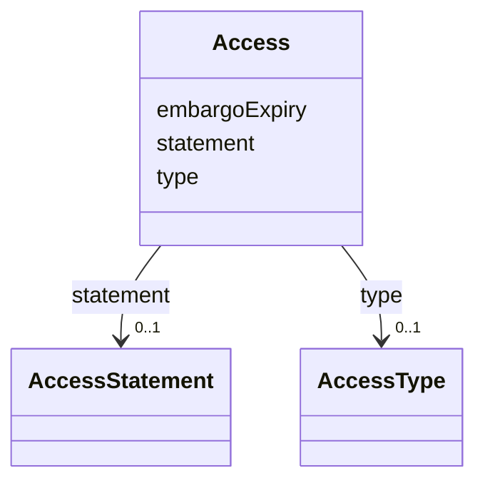

# Class: Access


URI: [https://raid.org/datamodel/api/raid/core/:Access](https://raid.org/datamodel/api/raid/core/:Access)





<!-- no inheritance hierarchy -->


## Slots

| Name | Cardinality and Range | Description | Inheritance |
| ---  | --- | --- | --- |
| [type](../slots/type.md) | 0..1 <br/> [AccessType](../classes/AccessType.md) |  | direct |
| [statement](../slots/statement.md) | 0..1 <br/> [AccessStatement](../classes/AccessStatement.md) |  | direct |
| [embargoExpiry](../slots/embargoExpiry.md) | 0..1 <br/> [date](../slots/date.md) |  | direct |


## Usages

| used by | used in | type | used |
| ---  | --- | --- | --- |
| [RaidDto](../classes/RaidDto.md) | [access](../slots/access.md) | range | [Access](../classes/Access.md) |
| [RaidCreateRequest](../classes/RaidCreateRequest.md) | [access](../slots/access.md) | range | [Access](../classes/Access.md) |
| [RaidUpdateRequest](../classes/RaidUpdateRequest.md) | [access](../slots/access.md) | range | [Access](../classes/Access.md) |
| [ClosedRaid](../classes/ClosedRaid.md) | [access](../slots/access.md) | range | [Access](../classes/Access.md) |


## Identifier and Mapping Information


### Schema Source


* from schema: https://raid.org/datamodel/api/raid/core


## Mappings

| Mapping Type | Mapped Value |
| ---  | ---  |
| self | https://raid.org/datamodel/api/raid/core/:Access |
| native | https://raid.org/datamodel/api/raid/core/:Access |


## LinkML Source

<!-- TODO: investigate https://stackoverflow.com/questions/37606292/how-to-create-tabbed-code-blocks-in-mkdocs-or-sphinx -->

### Direct

<details>
```yaml
name: Access
from_schema: https://raid.org/datamodel/api/raid/core
attributes:
  type:
    name: type
    from_schema: https://raid.org/datamodel/api/raid/core
    domain_of:
    - Title
    - Description
    - Access
    - RelatedRaid
    - RelatedObject
    - AlternateIdentifier
    range: AccessType
  statement:
    name: statement
    from_schema: https://raid.org/datamodel/api/raid/core
    rank: 1000
    domain_of:
    - Access
    range: AccessStatement
  embargoExpiry:
    name: embargoExpiry
    from_schema: https://raid.org/datamodel/api/raid/core
    rank: 1000
    domain_of:
    - Access
    range: date

```
</details>

### Induced

<details>
```yaml
name: Access
from_schema: https://raid.org/datamodel/api/raid/core
attributes:
  type:
    name: type
    from_schema: https://raid.org/datamodel/api/raid/core
    alias: type
    owner: Access
    domain_of:
    - Title
    - Description
    - Access
    - RelatedRaid
    - RelatedObject
    - AlternateIdentifier
    range: AccessType
  statement:
    name: statement
    from_schema: https://raid.org/datamodel/api/raid/core
    rank: 1000
    alias: statement
    owner: Access
    domain_of:
    - Access
    range: AccessStatement
  embargoExpiry:
    name: embargoExpiry
    from_schema: https://raid.org/datamodel/api/raid/core
    rank: 1000
    alias: embargoExpiry
    owner: Access
    domain_of:
    - Access
    range: date

```
</details>