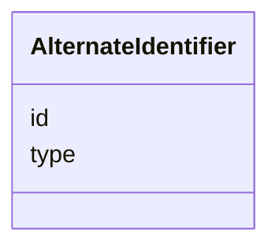

# Class: AlternateIdentifier


URI: [https://raid.org/datamodel/api/raid/core/:AlternateIdentifier](https://raid.org/datamodel/api/raid/core/:AlternateIdentifier)





<!-- no inheritance hierarchy -->


## Slots

| Name | Cardinality and Range | Description | Inheritance |
| ---  | --- | --- | --- |
| [id](../slots/id.md) | 1 <br/> [String](../types/String.md) |  | direct |
| [type](../slots/type.md) | 0..1 <br/> [String](../types/String.md) |  | direct |


## Usages

| used by | used in | type | used |
| ---  | --- | --- | --- |
| [RaidDto](../classes/RaidDto.md) | [alternateIdentifier](../slots/alternateIdentifier.md) | range | [AlternateIdentifier](../classes/AlternateIdentifier.md) |
| [RaidCreateRequest](../classes/RaidCreateRequest.md) | [alternateIdentifier](../slots/alternateIdentifier.md) | range | [AlternateIdentifier](../classes/AlternateIdentifier.md) |
| [RaidUpdateRequest](../classes/RaidUpdateRequest.md) | [alternateIdentifier](../slots/alternateIdentifier.md) | range | [AlternateIdentifier](../classes/AlternateIdentifier.md) |


## Identifier and Mapping Information


### Schema Source


* from schema: https://raid.org/datamodel/api/raid/core


## Mappings

| Mapping Type | Mapped Value |
| ---  | ---  |
| self | https://raid.org/datamodel/api/raid/core/:AlternateIdentifier |
| native | https://raid.org/datamodel/api/raid/core/:AlternateIdentifier |


## LinkML Source

<!-- TODO: investigate https://stackoverflow.com/questions/37606292/how-to-create-tabbed-code-blocks-in-mkdocs-or-sphinx -->

### Direct

<details>
```yaml
name: AlternateIdentifier
from_schema: https://raid.org/datamodel/api/raid/core
slots:
- id
- type

```
</details>

### Induced

<details>
```yaml
name: AlternateIdentifier
from_schema: https://raid.org/datamodel/api/raid/core
attributes:
  id:
    name: id
    from_schema: https://raid.org/datamodel/api/raid/core
    rank: 1000
    identifier: true
    alias: id
    owner: AlternateIdentifier
    domain_of:
    - ClosedRaid
    - Id
    - Contributor
    - Organisation
    - RelatedRaid
    - RelatedObject
    - AlternateIdentifier
    - Owner
    - RegistrationAgency
    - TitleType
    - DescriptionType
    - AccessType
    - ContributorPosition
    - ContributorRole
    - OrganisationRole
    - RelatedRaidType
    - RelatedObjectType
    - RelatedObjectCategory
    - Language
    - Subject
    - SpatialCoverage
    - TraditionalKnowledgeLabel
    range: string
    required: true
  type:
    name: type
    from_schema: https://raid.org/datamodel/api/raid/core
    rank: 1000
    alias: type
    owner: AlternateIdentifier
    domain_of:
    - Title
    - Description
    - Access
    - RelatedRaid
    - RelatedObject
    - AlternateIdentifier
    range: string

```
</details>