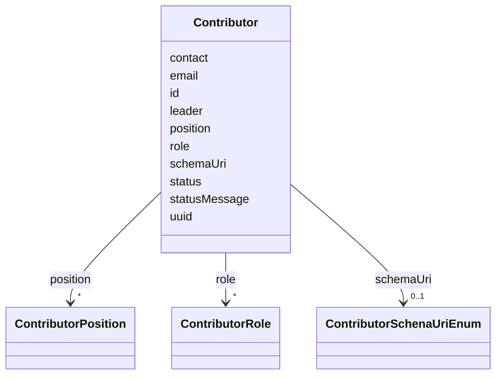

# Class: Contributor


URI: [https://raid.org/datamodel/api/raid/core/:Contributor](https://raid.org/datamodel/api/raid/core/:Contributor)





<!-- no inheritance hierarchy -->


## Slots

| Name | Cardinality and Range | Description | Inheritance |
| ---  | --- | --- | --- |
| [id](../slots/id.md) | 1 <br/> [String](../types/String.md) |  | direct |
| [status](../slots/status.md) | 0..1 <br/> [String](../types/String.md) |  | direct |
| [statusMessage](../slots/statusMessage.md) | 0..1 <br/> [String](../types/String.md) |  | direct |
| [uuid](../slots/uuid.md) | 0..1 <br/> [String](../types/String.md) |  | direct |
| [schemaUri](../slots/schemaUri.md) | 0..1 <br/> [ContributorSchenaUriEnum](../enums/ContributorSchenaUriEnum.md) |  | direct |
| [position](../slots/position.md) | * <br/> [ContributorPosition](../classes/ContributorPosition.md) |  | direct |
| [role](../slots/role.md) | * <br/> [ContributorRole](../classes/ContributorRole.md) |  | direct |
| [leader](../slots/leader.md) | 0..1 <br/> [Boolean](../types/Boolean.md) |  | direct |
| [contact](../slots/contact.md) | 0..1 <br/> [Boolean](../types/Boolean.md) |  | direct |
| [email](../slots/email.md) | 0..1 <br/> [String](../types/String.md) |  | direct |


## Usages

| used by | used in | type | used |
| ---  | --- | --- | --- |
| [RaidDto](../classes/RaidDto.md) | [contributor](../slots/contributor.md) | range | [Contributor](../classes/Contributor.md) |
| [RaidCreateRequest](../classes/RaidCreateRequest.md) | [contributor](../slots/contributor.md) | range | [Contributor](../classes/Contributor.md) |
| [RaidUpdateRequest](../classes/RaidUpdateRequest.md) | [contributor](../slots/contributor.md) | range | [Contributor](../classes/Contributor.md) |
| [RaidPatchRequest](../classes/RaidPatchRequest.md) | [contributor](../slots/contributor.md) | range | [Contributor](../classes/Contributor.md) |


## Identifier and Mapping Information


### Schema Source


* from schema: https://raid.org/datamodel/api/raid/core


## Mappings

| Mapping Type | Mapped Value |
| ---  | ---  |
| self | https://raid.org/datamodel/api/raid/core/:Contributor |
| native | https://raid.org/datamodel/api/raid/core/:Contributor |


## LinkML Source

<!-- TODO: investigate https://stackoverflow.com/questions/37606292/how-to-create-tabbed-code-blocks-in-mkdocs-or-sphinx -->

### Direct

<details>
```yaml
name: Contributor
from_schema: https://raid.org/datamodel/api/raid/core
slots:
- id
attributes:
  status:
    name: status
    annotations:
      readonly:
        tag: readonly
        value: true
    from_schema: https://raid.org/datamodel/api/raid/core
    rank: 1000
    domain_of:
    - Contributor
    range: string
  statusMessage:
    name: statusMessage
    annotations:
      readonly:
        tag: readonly
        value: true
    from_schema: https://raid.org/datamodel/api/raid/core
    rank: 1000
    domain_of:
    - Contributor
    range: string
  uuid:
    name: uuid
    annotations:
      readonly:
        tag: readonly
        value: true
    from_schema: https://raid.org/datamodel/api/raid/core
    rank: 1000
    domain_of:
    - Contributor
    range: string
  schemaUri:
    name: schemaUri
    from_schema: https://raid.org/datamodel/api/raid/core
    domain_of:
    - Id
    - Contributor
    - Organisation
    - RelatedObject
    - Owner
    - RegistrationAgency
    - TitleType
    - DescriptionType
    - AccessType
    - ContributorPosition
    - ContributorRole
    - OrganisationRole
    - RelatedRaidType
    - RelatedObjectType
    - RelatedObjectCategory
    - Language
    - Subject
    - SpatialCoverage
    - TraditionalKnowledgeLabel
    range: ContributorSchenaUriEnum
  position:
    name: position
    from_schema: https://raid.org/datamodel/api/raid/core
    rank: 1000
    domain_of:
    - Contributor
    range: ContributorPosition
    multivalued: true
  role:
    name: role
    from_schema: https://raid.org/datamodel/api/raid/core
    rank: 1000
    domain_of:
    - Contributor
    - Organisation
    range: ContributorRole
    multivalued: true
  leader:
    name: leader
    from_schema: https://raid.org/datamodel/api/raid/core
    rank: 1000
    domain_of:
    - Contributor
    range: boolean
  contact:
    name: contact
    from_schema: https://raid.org/datamodel/api/raid/core
    rank: 1000
    domain_of:
    - Contributor
    range: boolean
  email:
    name: email
    from_schema: https://raid.org/datamodel/api/raid/core
    rank: 1000
    domain_of:
    - Contributor
    range: string

```
</details>

### Induced

<details>
```yaml
name: Contributor
from_schema: https://raid.org/datamodel/api/raid/core
attributes:
  status:
    name: status
    annotations:
      readonly:
        tag: readonly
        value: true
    from_schema: https://raid.org/datamodel/api/raid/core
    rank: 1000
    alias: status
    owner: Contributor
    domain_of:
    - Contributor
    range: string
  statusMessage:
    name: statusMessage
    annotations:
      readonly:
        tag: readonly
        value: true
    from_schema: https://raid.org/datamodel/api/raid/core
    rank: 1000
    alias: statusMessage
    owner: Contributor
    domain_of:
    - Contributor
    range: string
  uuid:
    name: uuid
    annotations:
      readonly:
        tag: readonly
        value: true
    from_schema: https://raid.org/datamodel/api/raid/core
    rank: 1000
    alias: uuid
    owner: Contributor
    domain_of:
    - Contributor
    range: string
  schemaUri:
    name: schemaUri
    from_schema: https://raid.org/datamodel/api/raid/core
    alias: schemaUri
    owner: Contributor
    domain_of:
    - Id
    - Contributor
    - Organisation
    - RelatedObject
    - Owner
    - RegistrationAgency
    - TitleType
    - DescriptionType
    - AccessType
    - ContributorPosition
    - ContributorRole
    - OrganisationRole
    - RelatedRaidType
    - RelatedObjectType
    - RelatedObjectCategory
    - Language
    - Subject
    - SpatialCoverage
    - TraditionalKnowledgeLabel
    range: ContributorSchenaUriEnum
  position:
    name: position
    from_schema: https://raid.org/datamodel/api/raid/core
    rank: 1000
    alias: position
    owner: Contributor
    domain_of:
    - Contributor
    range: ContributorPosition
    multivalued: true
  role:
    name: role
    from_schema: https://raid.org/datamodel/api/raid/core
    rank: 1000
    alias: role
    owner: Contributor
    domain_of:
    - Contributor
    - Organisation
    range: ContributorRole
    multivalued: true
  leader:
    name: leader
    from_schema: https://raid.org/datamodel/api/raid/core
    rank: 1000
    alias: leader
    owner: Contributor
    domain_of:
    - Contributor
    range: boolean
  contact:
    name: contact
    from_schema: https://raid.org/datamodel/api/raid/core
    rank: 1000
    alias: contact
    owner: Contributor
    domain_of:
    - Contributor
    range: boolean
  email:
    name: email
    from_schema: https://raid.org/datamodel/api/raid/core
    rank: 1000
    alias: email
    owner: Contributor
    domain_of:
    - Contributor
    range: string
  id:
    name: id
    from_schema: https://raid.org/datamodel/api/raid/core
    rank: 1000
    identifier: true
    alias: id
    owner: Contributor
    domain_of:
    - ClosedRaid
    - Id
    - Contributor
    - Organisation
    - RelatedRaid
    - RelatedObject
    - AlternateIdentifier
    - Owner
    - RegistrationAgency
    - TitleType
    - DescriptionType
    - AccessType
    - ContributorPosition
    - ContributorRole
    - OrganisationRole
    - RelatedRaidType
    - RelatedObjectType
    - RelatedObjectCategory
    - Language
    - Subject
    - SpatialCoverage
    - TraditionalKnowledgeLabel
    range: string
    required: true

```
</details>