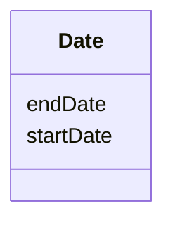

# Class: Date


URI: [https://raid.org/datamodel/api/raid/core/:Date](https://raid.org/datamodel/api/raid/core/:Date)





<!-- no inheritance hierarchy -->


## Slots

| Name | Cardinality and Range | Description | Inheritance |
| ---  | --- | --- | --- |
| [startDate](../slots/startDate.md) | 1 <br/> [String](../types/String.md) |  | direct |
| [endDate](../slots/endDate.md) | 0..1 <br/> [String](../types/String.md) |  | direct |


## Usages

| used by | used in | type | used |
| ---  | --- | --- | --- |
| [RaidDto](../classes/RaidDto.md) | [date](../slots/date.md) | range | [Date](../classes/Date.md) |
| [RaidCreateRequest](../classes/RaidCreateRequest.md) | [date](../slots/date.md) | range | [Date](../classes/Date.md) |
| [RaidUpdateRequest](../classes/RaidUpdateRequest.md) | [date](../slots/date.md) | range | [Date](../classes/Date.md) |


## Identifier and Mapping Information


### Schema Source


* from schema: https://raid.org/datamodel/api/raid/core


## Mappings

| Mapping Type | Mapped Value |
| ---  | ---  |
| self | https://raid.org/datamodel/api/raid/core/:Date |
| native | https://raid.org/datamodel/api/raid/core/:Date |


## LinkML Source

<!-- TODO: investigate https://stackoverflow.com/questions/37606292/how-to-create-tabbed-code-blocks-in-mkdocs-or-sphinx -->

### Direct

<details>
```yaml
name: Date
from_schema: https://raid.org/datamodel/api/raid/core
slots:
- startDate
- endDate

```
</details>

### Induced

<details>
```yaml
name: Date
from_schema: https://raid.org/datamodel/api/raid/core
attributes:
  startDate:
    name: startDate
    from_schema: https://raid.org/datamodel/api/raid/core
    rank: 1000
    alias: startDate
    owner: Date
    domain_of:
    - Date
    - Title
    - ContributorPosition
    - OrganisationRole
    range: string
    required: true
  endDate:
    name: endDate
    from_schema: https://raid.org/datamodel/api/raid/core
    rank: 1000
    alias: endDate
    owner: Date
    domain_of:
    - Date
    - Title
    - ContributorPosition
    - OrganisationRole
    range: string

```
</details>