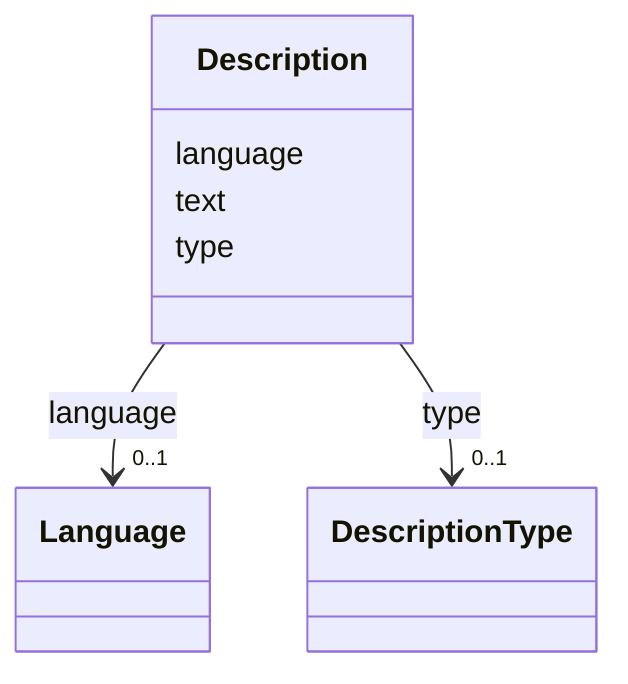

# Class: Description


URI: [https://raid.org/datamodel/api/raid/core/:Description](https://raid.org/datamodel/api/raid/core/:Description)





<!-- no inheritance hierarchy -->


## Slots

| Name | Cardinality and Range | Description | Inheritance |
| ---  | --- | --- | --- |
| [text](../slots/text.md) | 0..1 <br/> [String](../types/String.md) |  | direct |
| [language](../slots/language.md) | 0..1 <br/> [Language](../classes/Language.md) |  | direct |
| [type](../slots/type.md) | 0..1 <br/> [DescriptionType](../classes/DescriptionType.md) |  | direct |


## Usages

| used by | used in | type | used |
| ---  | --- | --- | --- |
| [RaidDto](../classes/RaidDto.md) | [description](../slots/description.md) | range | [Description](../classes/Description.md) |
| [RaidCreateRequest](../classes/RaidCreateRequest.md) | [description](../slots/description.md) | range | [Description](../classes/Description.md) |
| [RaidUpdateRequest](../classes/RaidUpdateRequest.md) | [description](../slots/description.md) | range | [Description](../classes/Description.md) |


## Identifier and Mapping Information


### Schema Source


* from schema: https://raid.org/datamodel/api/raid/core


## Mappings

| Mapping Type | Mapped Value |
| ---  | ---  |
| self | https://raid.org/datamodel/api/raid/core/:Description |
| native | https://raid.org/datamodel/api/raid/core/:Description |


## LinkML Source

<!-- TODO: investigate https://stackoverflow.com/questions/37606292/how-to-create-tabbed-code-blocks-in-mkdocs-or-sphinx -->

### Direct

<details>
```yaml
name: Description
from_schema: https://raid.org/datamodel/api/raid/core
slots:
- text
- language
attributes:
  type:
    name: type
    from_schema: https://raid.org/datamodel/api/raid/core
    domain_of:
    - Title
    - Description
    - Access
    - RelatedRaid
    - RelatedObject
    - AlternateIdentifier
    range: DescriptionType

```
</details>

### Induced

<details>
```yaml
name: Description
from_schema: https://raid.org/datamodel/api/raid/core
attributes:
  type:
    name: type
    from_schema: https://raid.org/datamodel/api/raid/core
    alias: type
    owner: Description
    domain_of:
    - Title
    - Description
    - Access
    - RelatedRaid
    - RelatedObject
    - AlternateIdentifier
    range: DescriptionType
  text:
    name: text
    from_schema: https://raid.org/datamodel/api/raid/core
    rank: 1000
    alias: text
    owner: Description
    domain_of:
    - Title
    - Description
    - AccessStatement
    - SubjectKeyword
    - SpatialCoveragePlace
    range: string
  language:
    name: language
    from_schema: https://raid.org/datamodel/api/raid/core
    rank: 1000
    alias: language
    owner: Description
    domain_of:
    - Title
    - Description
    - AccessStatement
    - SubjectKeyword
    - SpatialCoveragePlace
    range: Language

```
</details>