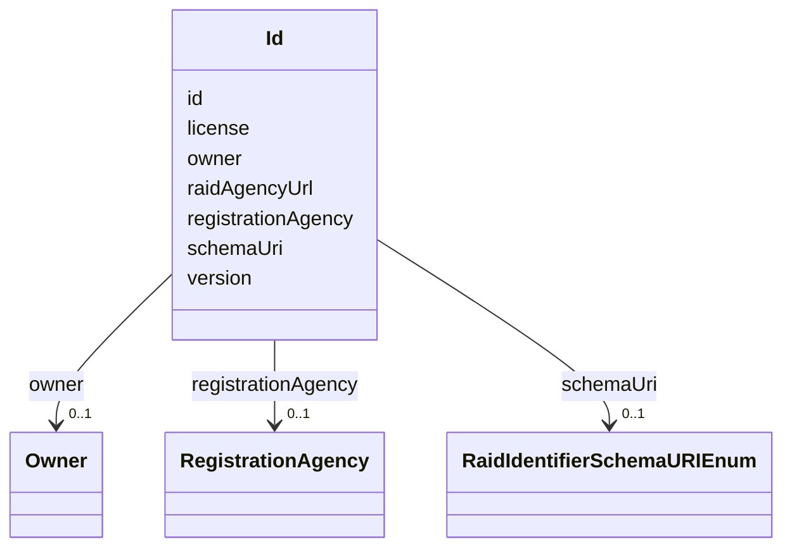

# Class: Id


URI: [https://raid.org/datamodel/api/raid/core/:Id](https://raid.org/datamodel/api/raid/core/:Id)





<!-- no inheritance hierarchy -->


## Slots

| Name | Cardinality and Range | Description | Inheritance |
| ---  | --- | --- | --- |
| [id](../slots/id.md) | 0..1 <br/> [String](../types/String.md) | The identifier of the raid, e | direct |
| [schemaUri](../slots/schemaUri.md) | 0..1 <br/> [RaidIdentifierSchemaURIEnum](../enums/RaidIdentifierSchemaURIEnum.md) |  | direct |
| [registrationAgency](../slots/registrationAgency.md) | 0..1 <br/> [RegistrationAgency](../classes/RegistrationAgency.md) |  | direct |
| [owner](../slots/owner.md) | 0..1 <br/> [Owner](../classes/Owner.md) |  | direct |
| [raidAgencyUrl](../slots/raidAgencyUrl.md) | 0..1 <br/> [String](../types/String.md) | The URL for the raid via the minting raid agency system | direct |
| [license](../slots/license.md) | 0..1 <br/> [String](../types/String.md) | The license under which the RAiD Metadata Record associated with this Identif... | direct |
| [version](../slots/version.md) | 0..1 <br/> [Integer](../types/Integer.md) | The version of the resource | direct |


## Usages

| used by | used in | type | used |
| ---  | --- | --- | --- |
| [RaidDto](../classes/RaidDto.md) | [identifier](../slots/identifier.md) | range | [Id](../classes/Id.md) |
| [RaidCreateRequest](../classes/RaidCreateRequest.md) | [identifier](../slots/identifier.md) | range | [Id](../classes/Id.md) |
| [RaidUpdateRequest](../classes/RaidUpdateRequest.md) | [identifier](../slots/identifier.md) | range | [Id](../classes/Id.md) |


## Identifier and Mapping Information


### Schema Source


* from schema: https://raid.org/datamodel/api/raid/core


## Mappings

| Mapping Type | Mapped Value |
| ---  | ---  |
| self | https://raid.org/datamodel/api/raid/core/:Id |
| native | https://raid.org/datamodel/api/raid/core/:Id |


## LinkML Source

<!-- TODO: investigate https://stackoverflow.com/questions/37606292/how-to-create-tabbed-code-blocks-in-mkdocs-or-sphinx -->

### Direct

<details>
```yaml
name: Id
from_schema: https://raid.org/datamodel/api/raid/core
attributes:
  id:
    name: id
    description: The identifier of the raid, e.g. https://raid.org.au/102.100.100/zzz
    examples:
    - value: https://raid.org/xxx.yyy/zzz
    from_schema: https://raid.org/datamodel/api/raid/core
    domain_of:
    - ClosedRaid
    - Id
    - Contributor
    - Organisation
    - RelatedRaid
    - RelatedObject
    - AlternateIdentifier
    - Owner
    - RegistrationAgency
    - TitleType
    - DescriptionType
    - AccessType
    - ContributorPosition
    - ContributorRole
    - OrganisationRole
    - RelatedRaidType
    - RelatedObjectType
    - RelatedObjectCategory
    - Language
    - Subject
    - SpatialCoverage
    - TraditionalKnowledgeLabel
    range: string
  schemaUri:
    name: schemaUri
    from_schema: https://raid.org/datamodel/api/raid/core
    rank: 1000
    domain_of:
    - Id
    - Contributor
    - Organisation
    - RelatedObject
    - Owner
    - RegistrationAgency
    - TitleType
    - DescriptionType
    - AccessType
    - ContributorPosition
    - ContributorRole
    - OrganisationRole
    - RelatedRaidType
    - RelatedObjectType
    - RelatedObjectCategory
    - Language
    - Subject
    - SpatialCoverage
    - TraditionalKnowledgeLabel
    range: RaidIdentifierSchemaURIEnum
  registrationAgency:
    name: registrationAgency
    from_schema: https://raid.org/datamodel/api/raid/core
    rank: 1000
    domain_of:
    - Id
    range: RegistrationAgency
  owner:
    name: owner
    from_schema: https://raid.org/datamodel/api/raid/core
    rank: 1000
    domain_of:
    - Id
    range: Owner
  raidAgencyUrl:
    name: raidAgencyUrl
    description: 'The URL for the raid via the minting raid agency system

      '
    from_schema: https://raid.org/datamodel/api/raid/core
    rank: 1000
    domain_of:
    - Id
    range: string
  license:
    name: license
    description: The license under which the RAiD Metadata Record associated with
      this Identifier has been issued.
    examples:
    - value: Creative Commons CC-0
    from_schema: https://raid.org/datamodel/api/raid/core
    rank: 1000
    domain_of:
    - Id
    range: string
  version:
    name: version
    description: The version of the resource. Read-only. Increments automatically
      on update.
    from_schema: https://raid.org/datamodel/api/raid/core
    rank: 1000
    domain_of:
    - Id
    range: integer

```
</details>

### Induced

<details>
```yaml
name: Id
from_schema: https://raid.org/datamodel/api/raid/core
attributes:
  id:
    name: id
    description: The identifier of the raid, e.g. https://raid.org.au/102.100.100/zzz
    examples:
    - value: https://raid.org/xxx.yyy/zzz
    from_schema: https://raid.org/datamodel/api/raid/core
    alias: id
    owner: Id
    domain_of:
    - ClosedRaid
    - Id
    - Contributor
    - Organisation
    - RelatedRaid
    - RelatedObject
    - AlternateIdentifier
    - Owner
    - RegistrationAgency
    - TitleType
    - DescriptionType
    - AccessType
    - ContributorPosition
    - ContributorRole
    - OrganisationRole
    - RelatedRaidType
    - RelatedObjectType
    - RelatedObjectCategory
    - Language
    - Subject
    - SpatialCoverage
    - TraditionalKnowledgeLabel
    range: string
  schemaUri:
    name: schemaUri
    from_schema: https://raid.org/datamodel/api/raid/core
    rank: 1000
    alias: schemaUri
    owner: Id
    domain_of:
    - Id
    - Contributor
    - Organisation
    - RelatedObject
    - Owner
    - RegistrationAgency
    - TitleType
    - DescriptionType
    - AccessType
    - ContributorPosition
    - ContributorRole
    - OrganisationRole
    - RelatedRaidType
    - RelatedObjectType
    - RelatedObjectCategory
    - Language
    - Subject
    - SpatialCoverage
    - TraditionalKnowledgeLabel
    range: RaidIdentifierSchemaURIEnum
  registrationAgency:
    name: registrationAgency
    from_schema: https://raid.org/datamodel/api/raid/core
    rank: 1000
    alias: registrationAgency
    owner: Id
    domain_of:
    - Id
    range: RegistrationAgency
  owner:
    name: owner
    from_schema: https://raid.org/datamodel/api/raid/core
    rank: 1000
    alias: owner
    owner: Id
    domain_of:
    - Id
    range: Owner
  raidAgencyUrl:
    name: raidAgencyUrl
    description: 'The URL for the raid via the minting raid agency system

      '
    from_schema: https://raid.org/datamodel/api/raid/core
    rank: 1000
    alias: raidAgencyUrl
    owner: Id
    domain_of:
    - Id
    range: string
  license:
    name: license
    description: The license under which the RAiD Metadata Record associated with
      this Identifier has been issued.
    examples:
    - value: Creative Commons CC-0
    from_schema: https://raid.org/datamodel/api/raid/core
    rank: 1000
    alias: license
    owner: Id
    domain_of:
    - Id
    range: string
  version:
    name: version
    description: The version of the resource. Read-only. Increments automatically
      on update.
    from_schema: https://raid.org/datamodel/api/raid/core
    rank: 1000
    alias: version
    owner: Id
    domain_of:
    - Id
    range: integer

```
</details>