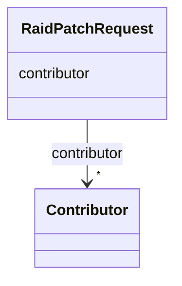

# Class: RaidPatchRequest


URI: [https://raid.org/datamodel/api/raid/core/:RaidPatchRequest](https://raid.org/datamodel/api/raid/core/:RaidPatchRequest)





<!-- no inheritance hierarchy -->


## Slots

| Name | Cardinality and Range | Description | Inheritance |
| ---  | --- | --- | --- |
| [contributor](../slots/contributor.md) | * <br/> [Contributor](../classes/Contributor.md) |  | direct |


## Identifier and Mapping Information


### Schema Source


* from schema: https://raid.org/datamodel/api/raid/core


## Mappings

| Mapping Type | Mapped Value |
| ---  | ---  |
| self | https://raid.org/datamodel/api/raid/core/:RaidPatchRequest |
| native | https://raid.org/datamodel/api/raid/core/:RaidPatchRequest |


## LinkML Source

<!-- TODO: investigate https://stackoverflow.com/questions/37606292/how-to-create-tabbed-code-blocks-in-mkdocs-or-sphinx -->

### Direct

<details>
```yaml
name: RaidPatchRequest
from_schema: https://raid.org/datamodel/api/raid/core
slots:
- contributor

```
</details>

### Induced

<details>
```yaml
name: RaidPatchRequest
from_schema: https://raid.org/datamodel/api/raid/core
attributes:
  contributor:
    name: contributor
    from_schema: https://raid.org/datamodel/api/raid/core
    rank: 1000
    slot_uri: schema:author
    alias: contributor
    owner: RaidPatchRequest
    domain_of:
    - RaidDto
    - RaidPatchRequest
    range: Contributor
    multivalued: true
    inlined: true
    inlined_as_list: true

```
</details>