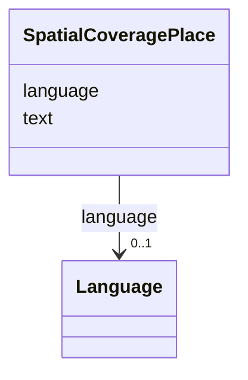

# Class: SpatialCoveragePlace


URI: [https://raid.org/datamodel/api/raid/extended/:SpatialCoveragePlace](https://raid.org/datamodel/api/raid/extended/:SpatialCoveragePlace)





<!-- no inheritance hierarchy -->


## Slots

| Name | Cardinality and Range | Description | Inheritance |
| ---  | --- | --- | --- |
| [text](../slots/text.md) | 0..1 <br/> [String](../types/String.md) |  | direct |
| [language](../slots/language.md) | 0..1 <br/> [Language](../classes/Language.md) |  | direct |


## Usages

| used by | used in | type | used |
| ---  | --- | --- | --- |
| [SpatialCoverage](../classes/SpatialCoverage.md) | [place](../slots/place.md) | range | [SpatialCoveragePlace](../classes/SpatialCoveragePlace.md) |


## Identifier and Mapping Information


### Schema Source


* from schema: https://raid.org/datamodel/api/raid/extended


## Mappings

| Mapping Type | Mapped Value |
| ---  | ---  |
| self | https://raid.org/datamodel/api/raid/extended/:SpatialCoveragePlace |
| native | https://raid.org/datamodel/api/raid/extended/:SpatialCoveragePlace |


## LinkML Source

<!-- TODO: investigate https://stackoverflow.com/questions/37606292/how-to-create-tabbed-code-blocks-in-mkdocs-or-sphinx -->

### Direct

<details>
```yaml
name: SpatialCoveragePlace
from_schema: https://raid.org/datamodel/api/raid/extended
slots:
- text
- language

```
</details>

### Induced

<details>
```yaml
name: SpatialCoveragePlace
from_schema: https://raid.org/datamodel/api/raid/extended
attributes:
  text:
    name: text
    from_schema: https://raid.org/datamodel/api/raid/extended
    rank: 1000
    alias: text
    owner: SpatialCoveragePlace
    domain_of:
    - SubjectKeyword
    - SpatialCoveragePlace
    range: string
  language:
    name: language
    from_schema: https://raid.org/datamodel/api/raid/extended
    rank: 1000
    alias: language
    owner: SpatialCoveragePlace
    domain_of:
    - SubjectKeyword
    - SpatialCoveragePlace
    range: Language

```
</details>