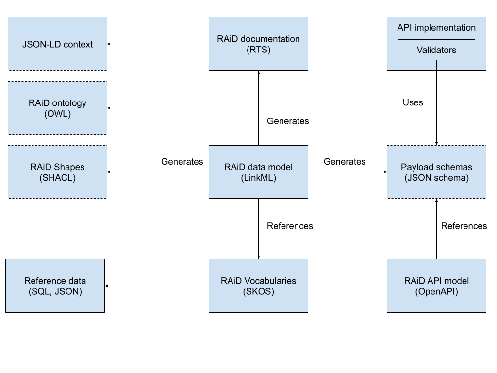

# Data model project

## TODO: 
* Add implementation for filling and storing Metadata.raidModelVersion and make it required in the data model. This field can be used in the RAiD crosswalks to determine the right crosswalk implementation. 
* reference data and strict JSON Schema generators both download the vocabulary data. This should be optimized so that the data is downloaded only once. 
* Modify generator tasks to process all versions at the same time.

This project contains the RAiD data model specification that is used as the single source for all the generated artefacts. The model is represented as (LinkML)[https://linkml.io] model. 


Figure 1. Overview of the data model and generated artefacts.

## Directory structure

- examples - linkml documentation generator related example data. Generated by GenerateReferenceDataTask.
- generated
  - [model version] - contains generated JSON schemas and flyway migration files.
    - documentation - generated markdown files for RAiD API documentation site
- mkdocs-config - additional files that will be added to the site. 
  - [model version]
    - documentation
- src
  - [model version] - linkml data model files.
- templates - customized templates used by the documentation generator. 
  - datamodel-docs
  - schema-docs

# Data model specification 

RAiD data model specification is defined using LinkML (https://linkml.io) language.

**annotations**

Annotations are used to include more detailed descriptions such as constraints. All annotations are included in the generated documentation as key-value pairs (See Documentation section below). 

```
ContributorPosition:
  annotations:
    constraints:  contributors must have one and only one position at any given time (contributors may also be flagged as a ‘leader’ or ‘contact’ separately).
    notes:  This property represents a contributor’s administrative position on a project (such as their position on a grant application); use contributor.role to define for scientific or scholarly contribution.
  description: a metadata schema sub-block describing a contributor’s administrative position on a project or activity   
```

**non-empty properties**

Properties that must not be empty when included in the data are implemented using a regular expression pattern for values. The current pattern is "^\\s*\\S.*$" which does not match only whitespace values. 

**mappings**

Mappings to other vocabularies/ontologies are added using exact_mappings, close_mappings, related_mappings, narrow_mappings and broad_mappings slots. 

**dynamic enumerations**

When the allowed values of a property are maintained in an external vocabulary the range of the property is described as a dynamic enumeration. 

Yaml 1. Example of ConceptScheme based dynamic enumeration
```
OrganizationRoleSchemaUriEnum:
  reachable_from:
    source_ontology: https://vocabs.ardc.edu.au/repository/api/sparql/raid_research-activity-identifier-raid-controlled-lists_raid-cl-v1-1
    source_nodes:
      - https://vocabulary.raid.org/organisation.role.schemaUri/281
    relationship_types:
      - skos:hasTopConcept
    is_direct: true
    traverse_up: false
    include_self: false

```

Yaml 2. Example of parent Concept based dynamic enumeration
``` 
OrganizationRoleIdEnum:
  reachable_from:
    source_ontology: https://vocabs.ardc.edu.au/repository/api/sparql/raid_research-activity-identifier-raid-controlled-lists_raid-cl-v1-1
    source_nodes:
      - https://vocabulary.raid.org/organisation.schemaUri/282
    relationship_types:
      - skos:narrower
    is_direct: true
    traverse_up: false
    include_self: false      
```

This configuration is used by the custom generators to fetch the actual values. `source_ontology` is used to point to the sparql endpoint through which the data about the vocabularies can be queried. `source_nodes` and `relationship_types` properties are used to generated the query to fetch vocabulary concepts. If the allowed values are the top concepts of a `skos:ConceptScheme` a combination of scheme URI and `skos:hasTopConcept` is used (See Yaml 1.). In case the allowed values all share the same parent concept source node becomes the URI of the parent concept with `skos:narrower` as the relationship type (See Yaml 2.). 
Other properties of the dynamic enumeration (is_direct, traverse_up and include_self) are not used a the moment.

**use of oneOf/allOf**

Some properties could have been extended with oneOf/allOf type of descriptions but that kind of constructs were not yet properly supported by the downstream tooling. For example validation based on one of multiple patterns was not included in the data model but implemented as part of the validator code.

So do not use oneOf/allOf yet. 

# Generated artefacts

Generation of derived artefacts is done using the linkml docker image from the docker hub. A task called `generateAll` can be used to regenerated all necessary things at once. 

## Documentation

Generated documentation is based on [Mkdocs](https://www.mkdocs.org/) site generated and uses [Material for Mkdocs](https://squidfunk.github.io/mkdocs-material/) theme with [Awesome Nav for MkDocs](https://lukasgeiter.github.io/mkdocs-awesome-nav/) plugin.  
Tools for building and publishing new versions of the documentation can installed using the `mkdocs-config/requirements.txt` file. 

```
python -m venv .venv
source .venv/bin/activate
mike ...
```

### Generator templates

The output of the LinkML [document generator](https://linkml.io/linkml/generators/docgen.html) can be altered by modifying files under `templates/[site]` directory. 

Any customisation to index, class, slot (property) or enum pages should be added through the template files instead of adding static pages because for example static page `index.md` under mkdocs-config would override the generated index page.  

### Examples

The `examples` directory contains generated examples files for allowed values of enumerations. These can identified by `-allowed-values.yaml` prefix. 

The directory can also be used to add manual examples to classes. For example, to add example JSON document to the `Access` element, one can add a file `Access-[id of the examples].yaml` to the `examples` directory. After regenerating the file, the content of the file will be visible as part of the Access class' documentation page. 

### Navigation customisations

Changes to site navigation can be made by adjusting the `.nav.yml` files under mkdocs-config/[version]/[site] directory. See [Awesome Nav for MkDocs](https://lukasgeiter.github.io/mkdocs-awesome-nav/) documentation for more information.

### Adding static pages

Additional content can be added under `mkdocs-config/[version]/documentation/docs` directory. 

For example, the following are needed to add an about page:

* Add `mkdocs-config/v2/documentation/docs/about.md` file with the desired markdown content.
* Modify `mkdocs-config/v2/documentation/docs/.nav.yml` 
  * Add row `- About: about.md` under the root nav: 
* Rebuild

### Versioning documentation 

Documentation versioning is done with [mike](https://github.com/jimporter/mike). 

**How it works**

"mike works by creating a new Git commit on your gh-pages branch every time you deploy a new version of your docs using mike deploy (or other mike subcommands that change your gh-pages branch). When deploying a particular version, previously-deployed docs for that version are erased and overwritten, but docs for other versions remain untouched."

First generate the documentation and then run `mike [params]` in the `generated/[version]/documentation` directory.

Add new documentation version:
```
mike deploy [version] --push
```

or with an alias:
```
mike deploy --push --update-aliases [version] latest
```

## JSON schemas

JSON schema generation is done using the `generateJSONSchemaV2` docker task and linkml/linkml image. 

Schemas are generated using `gen-json-schema` generator with the `raid-core.yaml` as the parameter. Core specification import the extended model so both of them will included in the generated output. 

JSON schemas are used by the idl-raid project to assemble the OpenAPI specification.

## Reference data

Reference data tasks (`generateReferenceData` and `generateExtendedReferenceData`) take 
 LinkML dynamic enumeration definitions as their primary input, fetch the vocabulary data and create flyway and documentation example outputs. 

For details see documentation in the buildSrc project.

Example configuration:
```
tasks.register('generateReferenceData', GenerateReferenceDataTask) {
  dataModelPath = 'api-svc/datamodel/src/v2/core-enums.yaml'
  outputFile = "api-svc/datamodel/generated/v2/referencedata.sql"
  examplesDir = "api-svc/datamodel/examples/"
  mappingFile = "buildSrc/enum2table.yaml"
  schemaID = 3
}
```

## Others

There are tasks in the datamodel project for generating JSON-LD context, OWL ontology and SHACL shapes from the specificiation. The current implementation of the JSON-LD context and SHACL generators does not yet support dynamic enumeration, which causes  `generateJSONLDContextV2` and `generateSHACLV2` tasks to fail. A workaround would be to add a custom task that would add create a version of the linkml specification that would include the materialized enumeration with values queried from the vocabulary service.

# Creating new data model versions

Datamodel project structure has been designed in a way that keeps all the different data model versions visible and editable at the same time. Although t might be convenient to create version related subdirectories for major (breaking) revisions only. 

General step for creating a new data model version are:
* create new directory under `src` (e.g. `v3.0`).
* copy LinkML files from the previous version.
* make required changes to data model specification.
* add/change generator tasks 
  * :api-svc:datamodel:generateDatamodelDocsV2
  * :api-svc:datamodel:generateSchemaDocsV2
  * :api-svc:datamodel:generateInternalJsonSchemaV2
  * :api-svc:datamodel:generateJSONSchemaV2
  * :api-svc:datamodel:generateReferenceDataV2
    * Note: data model version. 
  * :api-svc:datamodel:generateExtendedReferenceDataV2
  * :api-svc:datamodel:generateAllV2
* In case of new dynamic enumerations, update `enum2table.yaml` and `extended-enum2table.yaml` files under buildSrc project.
* Generate new data model artefacts (`:api-svc:datamodel:generateAllX`)
* Modify tasks in the idl-raid-[version] project to use the correct generated files from the datamodel project
  * e.g. `generatedSchemaFile = file("../datamodel/generated/v2/raid-jsonschema.json")` --> `generatedSchemaFile = file("../datamodel/generated/v3/raid-jsonschema.json")`
* Add generated reference data to the database.
* Deploy and push new version of the data model documentation

## Non-breaking changes 

Non-breaking changes include:
* Adding new properties to data model
* Adding new terms to the referenced vocabularies
* Removing *required* from data model properties

These changes can be implemented as minor changes (e.g. 2.0 -> 2.1) to data model.

## Breaking changes

Breaking changes include:
* Structural changes to the model
  * Property name changes
  * Property is removed
  * Required property is added
* Breaking changes to referenced vocabularies
  * Changes to semantics of the current vocabularies
  * Removal of concepts from referenced vocabularies
  * Introduction of a new vocabulary

There changes require new major version of the data model to be added (e.g. v2.0 -> v3.0).

## Deprecation 

Any part of the data model can be marked as deprecated by adding to it a slot `deprecated: true`.

Example:
```
id: https://datamodel.raid.org/core/
name: RAiD-core
version: 1
deprecated: true
```

If vocabularies or vocabulary items are deprecated a flyway migration file must be added manually that sets the status of the target rows to `inactive`.
