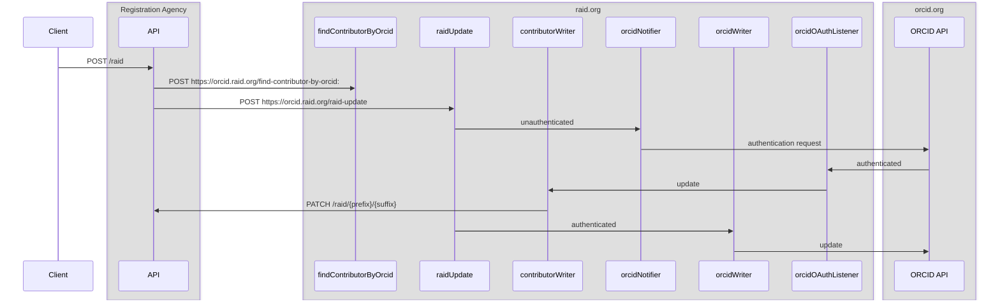

# ORCID Integration

## Introduction
At ORCID's request, RAiD has moved ORCID integration from registration agencies to the registration authority. This
provide a more unified experience to the end user and make things easier to manage.

## What's changed
Previously the ORCID integration, which consists of a number of AWS Lambda handlers and TypeScript, or something
functionally equivalent for those registration agencies that opted to do it themselves, would need to be deployed for
each registration agency with separate credentials for each registration agencies. ORCID integration is now deployed to
the raid.org AWS account with HTTP endpoints to manage ORCID authentication. The same components are used as before
except they've been moved to the raid.org AWS account. As such extra authentication is required both for registration
agencies to call the endpoints and for raid.org to patch affected raids after an ORCID has been authenticated.

Given that the RAiD API and the ORCID integration now reside in different systems, the RAiD API needs to authenticate
with the ORCID integration and vice versa. Therefore raid.org will issue an API key to registration agencies and the
registration agencies will need to issue a client id and client secret to raid.org.

### Registration Agency -> raid.org authentication
Raid.org will issue an API key to registration agencies in order to authenticate with raid. The API key should be sent
in an `x-api-key` header with every HTTP request to the ORCID integration endpoints.

### raid.org -> Registration Agency authentication
The registration agency will need to issue a client id and client secret to raid.org. These credentials will be used to
request an access token which will be passed in the `Authorization` header. The credentials will need to have the
`contributor-writer` role.

